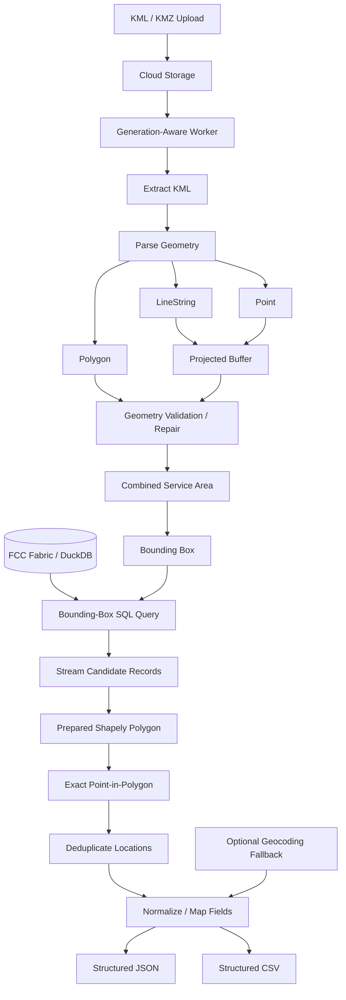

# Fiber Service Area Mapping Pipeline

A geospatial data-processing pipeline I built to turn fiber service-area boundaries into structured, address-level location datasets.

The system accepts KML or KMZ network boundaries, converts the source geometry into usable service-area polygons, queries a large FCC Broadband Fabric dataset stored in DuckDB, performs exact point-in-polygon matching with Shapely, normalizes the matched location records, and generates structured JSON and CSV output for downstream use.

The pipeline can run automatically in Google Cloud when a new service-area file is uploaded and includes duplicate-processing protection, generation-aware locking, data-lineage metadata, optional cost-controlled geocoding fallback, and repeatable export logic.

> Production source code and operational datasets are maintained privately because they contain proprietary service-area information, internal processing logic, licensed or restricted reference data, infrastructure configuration, and company-specific output requirements.

---

## Project Context

**Initial development:** June 2025  
**Status:** Evolved into the current production pipeline through ongoing development  
**Public showcase:** August 2026

The project began as a simpler service-area and address-processing workflow and evolved into the current geospatial pipeline as the data, automation, and operational requirements became more sophisticated.

This repository is a sanitized portfolio representation of the privately maintained production system. The public commit history reflects the creation and maintenance of this showcase, not the full development history of the production pipeline.

---

## Overview

Network service areas are usually defined geographically.

Marketing, sales, operations, and reporting usually need to work at the address or location level.

That creates a practical problem:

> Given a fiber construction or service-area boundary, which broadband-serviceable locations actually fall inside that footprint?

I built this pipeline to automate that conversion.

Instead of manually comparing addresses against maps or working through large reference datasets in spreadsheets, the program takes the service-area geometry through a repeatable spatial-processing workflow and produces a structured location file.

At a high level:

```text
KML / KMZ Service Area
        ↓
Parse Geometry
        ↓
Repair / Buffer / Normalize
        ↓
Combined Service Polygon
        ↓
Calculate Bounding Box
        ↓
Query FCC Fabric in DuckDB
        ↓
Stream Candidate Locations
        ↓
Exact Shapely Point-in-Polygon
        ↓
Deduplicate
        ↓
Normalize / Enrich
        ↓
Structured JSON + CSV
```

---

## What the Pipeline Handles

The project includes work across:

- KML and KMZ ingestion
- XML geometry parsing
- Polygon processing
- MultiPolygon handling
- Geometry validation and repair
- LineString buffering
- Point buffering
- Coordinate-reference transformations
- Service-area unioning
- DuckDB querying
- Bounding-box filtering
- Batched record streaming
- Exact point-in-polygon matching
- FCC Broadband Fabric location extraction
- Census geography extraction
- Address normalization
- Location deduplication
- Optional reverse-geocoding fallback
- Spatial nearest-neighbor searches
- API cost controls
- Cloud Storage event processing
- Generation-aware duplicate protection
- Processing locks
- Stale-lock recovery
- Output lineage tracking
- JSON generation
- CSV generation
- Import-ready schema control

---

## Technology

The pipeline uses:

- Python
- DuckDB
- SQL
- Shapely
- PyProj
- KML / KMZ
- XML
- FCC Broadband Fabric
- Census geography
- Google Cloud Storage
- CloudEvents
- Google Cloud Functions
- Google Maps Geocoding API
- JSON
- CSV
- Spatial indexing
- Geospatial processing

---

# Core Architecture



The spatial workload is deliberately split between DuckDB and Shapely.

```text
DuckDB
   ↓
Fast Candidate Reduction

Shapely
   ↓
Exact Geographic Decision
```

DuckDB determines which records are worth evaluating.

Shapely determines whether each candidate actually falls inside the service-area geometry.

---

# Input Geometry

The pipeline accepts both:

```text
.kml
.kmz
```

A KMZ file is opened as a ZIP archive and the contained KML document is extracted before geometry processing begins.

The KML parser does not assume that every service area is represented by one clean polygon.

Supported geometry can include:

```text
Polygon
MultiPolygon
LineString
Point
Multiple Placemarks
```

---

# Geometry Processing

Real-world service-area files can contain geometry that needs to be cleaned or transformed before it can be used for address qualification.

The pipeline handles each geometry type differently.

## Polygons

Polygon exterior boundaries are extracted from the KML.

The geometry is validated with Shapely and repaired when necessary.

```text
KML Polygon
      ↓
Exterior Coordinates
      ↓
Shapely Polygon
      ↓
Valid?
  /        \
Yes         No
 ↓           ↓
Use      make_valid()
             ↓
          Use Result
```

If a repair produces a MultiPolygon, its polygon members can be retained individually.

---

## LineStrings

Some network boundaries or routes are represented as LineStrings rather than closed polygons.

Those paths cannot be used directly for point-in-polygon testing.

Instead, the workflow:

```text
LineString
    ↓
Transform WGS84 → Projected CRS
    ↓
Buffer by Distance in Meters
    ↓
Transform Back to WGS84
    ↓
Service-Area Polygon
```

The LineString remains open before buffering. It is not artificially closed into a polygon ring.

---

## Points

Point geometry can also be converted into a small coverage polygon.

```text
Point
  ↓
Projected CRS
  ↓
Meter-Based Buffer
  ↓
WGS84 Polygon
```

---

## Combined Service Area

After the individual geometry pieces are normalized, they are combined into one service-area geometry.

```text
Polygon A
    +
Polygon B
    +
Buffered LineString
    +
Buffered Point
    ↓
unary_union()
    ↓
Combined Service Area
```

The combined result is validated again before spatial extraction begins.

---

# FCC Broadband Fabric Extraction

The FCC Broadband Fabric dataset is stored in DuckDB and acts as the primary location source for the spatial extraction workflow.

Each reference record can contain fields such as:

```text
Location ID
Address
City
State
ZIP
Latitude
Longitude
Census Block GEOID
BSL Flag
Building Type
Land-Use Type
Unit Count
Fabric Release
Other Selected Reference Fields
```

The public repository does not include licensed Fabric records.

---

# Two-Stage Spatial Matching

A central design decision in this pipeline is not to perform an exact geometry operation against every record in the reference dataset.

Instead, matching happens in two stages.

## Stage 1 — Bounding-Box Query

The program calculates the service area's bounds:

```text
Minimum Longitude
Minimum Latitude
Maximum Longitude
Maximum Latitude
```

DuckDB then retrieves only locations whose coordinates fall inside that rectangle.

Conceptually:

```sql
SELECT
    location_id,
    address_primary,
    city,
    state,
    zip,
    latitude,
    longitude
FROM reference_locations
WHERE latitude BETWEEN ? AND ?
  AND longitude BETWEEN ? AND ?;
```

The production query also handles optional columns and source fields whose data types may vary.

---

## Stage 2 — Exact Point-in-Polygon

A bounding box is deliberately broader than the true service-area shape.

Every candidate still needs an exact spatial test.

```text
DuckDB Candidate
       ↓
Latitude / Longitude
       ↓
Shapely Point
       ↓
Prepared Service Polygon
       ↓
Intersects?
   /          \
 No            Yes
 ↓              ↓
Exclude       Include
```

A prepared Shapely geometry is used for repeated spatial checks against the same service-area boundary.

This gives DuckDB and Shapely separate jobs:

```text
DuckDB → Reduce the dataset quickly

Shapely → Make the exact spatial decision
```

---

# Batched Processing

The candidate query is streamed in batches.

```text
DuckDB Query
     ↓
Batch 1
     ↓
Spatial Test

Batch 2
     ↓
Spatial Test

Batch 3
     ↓
Spatial Test
```

This avoids requiring the entire candidate result set to be loaded into Python memory at once.

That becomes increasingly important as service-area boundaries cover larger geographic areas.

---

# Defensive Source Schema Handling

Reference datasets can change between releases.

The worker inspects the DuckDB table before building the query.

Required fields such as:

```text
address_primary
latitude
longitude
```

must be available.

Other fields can be selected conditionally.

When an optional field is unavailable, the public implementation can substitute a null value instead of failing the entire extraction.

The workflow also uses safe numeric conversion for coordinate fields instead of assuming every source release uses exactly the same column type.

---

# Location Deduplication

The pipeline prefers an authoritative location identifier for deduplication.

```text
FCC / Fabric Location ID Available?
          /             \
        Yes              No
         ↓                ↓
Use Location ID      Build Address Key
                         ↓
                  Address + City +
                    State + ZIP
```

Address-based deduplication is therefore a fallback rather than a replacement for an official location identifier.

---

# Address Normalization

Address strings can vary even when they represent the same physical location.

Examples:

```text
101 Sample Road
101 SAMPLE RD
101 Sample Rd.
```

The normalization layer performs deterministic cleanup including:

```text
Uppercasing
Street-suffix normalization
Punctuation cleanup
Whitespace cleanup
ZIP cleanup
House-number extraction
```

The purpose is not to rewrite the source data completely.

It is to create more stable comparison and export values.

---

# Census Geography

For matched Fabric locations, Census geography can be derived from the Census block GEOID included with the source record.

A standard 15-digit block GEOID can be separated into:

```text
State      → digits 1–2
County     → digits 3–5
Tract      → digits 6–11
Block      → digits 12–15
```

Conceptually:

```text
15-Digit Census Block GEOID
            ↓
   ┌────────┼──────────┐
   ↓        ↓          ↓
 State    County      Tract
                       ↓
                     Block
```

This keeps the geographic identifiers tied to the matched reference location.

---

# Optional Geocoding Fallback

The primary workflow uses the reference dataset.

An optional reverse-geocoding process can be enabled to inspect areas of the polygon that do not already have nearby matched reference locations.

It is deliberately disabled or constrained unless needed because large-scale reverse geocoding can create substantial external API usage.

The fallback works conceptually like this:

```text
Service Area
      +
Matched Fabric Locations
      ↓
Generate Sample Grid
      ↓
Nearest Existing Location
      ↓
Within Skip Radius?
   /             \
 Yes              No
  ↓                ↓
Skip         Reverse Geocode
                   ↓
             Valid Address?
                   ↓
         Coordinates Still Inside
             Service Area?
                   ↓
              Deduplicate
                   ↓
             Add Fallback
```

---

## Spatial Indexing

Matched points are indexed with Shapely's `STRtree`.

This allows the fallback to find the nearest existing location without comparing every sample point against every known point.

```text
Matched Locations
       ↓
STRtree Index
       ↓
Sample Point
       ↓
Nearest Neighbor
       ↓
Distance Check
```

---

## Haversine Distance

The nearest-location check uses great-circle distance to estimate physical separation between coordinates.

This supports a configurable skip radius.

If a sample point is already sufficiently close to an existing matched location, no geocoding request is made.

---

## Cost Controls

The optional geocoding path includes several protections:

- Hard maximum request count
- Configurable sample spacing
- Existing-location skip radius
- Request delay
- Polygon revalidation
- Duplicate detection

The external geocoder supplements the primary dataset rather than replacing it.

---

# Cloud Processing

The pipeline can run as an event-driven Google Cloud worker.

When a KML or KMZ file is uploaded:

```text
Cloud Storage Upload
        ↓
CloudEvent
        ↓
Validate File
        ↓
Check Source Generation
        ↓
Already Completed?
     /            \
   Yes             No
    ↓               ↓
  Stop          Acquire Lock
                    ↓
               Run Pipeline
                    ↓
                 Export
```

---

# Source Generations

Cloud Storage objects have immutable generations.

That matters because a file can be replaced while keeping the same filename.

For example:

```text
fiber-area.kmz
Generation 1001

fiber-area.kmz
Generation 1047
```

Those are different source objects from the worker's perspective.

The output metadata therefore records the exact source generation used to produce the result.

---

# Duplicate Processing Protection

Cloud Storage events can be delivered more than once.

The worker checks whether the final output already belongs to the same source object generation before starting another run.

```text
Storage Event
     ↓
Output Exists?
     ↓
Same Source Generation?
   /                  \
 Yes                   No
  ↓                     ↓
Stop               Continue
```

---

# Generation-Specific Processing Locks

Before running the expensive spatial workflow, the worker attempts to create a generation-specific lock using an atomic Cloud Storage operation.

```text
Worker A ──┐
           ├── Attempt Same Lock
Worker B ──┘
              ↓
       Only One Succeeds
```

The other worker exits instead of running the same extraction simultaneously.

---

# Stale-Lock Recovery

A worker can fail unexpectedly after acquiring a lock.

The lock therefore contains a start time.

```text
Existing Lock
     ↓
How Old?
   /       \
Fresh      Stale
 ↓           ↓
Stop       Replace
```

Generation preconditions are used when replacing the stale object so competing workers cannot both win the recovery race.

---

# Completion-Marker Design

The pipeline produces both JSON and CSV output.

The write order is deliberate.

```text
Processing Complete
       ↓
Write JSON
       ↓
Write CSV
       ↓
Run Considered Complete
```

The CSV is uploaded last and acts as the completion marker for the source generation.

If the worker fails after JSON is written but before the CSV is produced, a future event does not incorrectly assume that the run finished successfully.

---

# Structured Export

The public export layer uses a stable schema:

```text
location_id
address_1
address_2
city
state
zip
latitude
longitude
census_state
census_county
census_tract
census_block
bsl_flag
building_type
land_use_type
unit_count
fabric_release
verification_source
```

Source-specific fields are mapped into this structure before serialization.

Coordinates are normalized to consistent precision and Census geography is broken into explicit components.

---

## Example Output

A synthetic example:

```csv
location_id,address_1,address_2,city,state,zip,latitude,longitude,census_state,census_county,census_tract,census_block,bsl_flag,building_type,land_use_type,unit_count,fabric_release,verification_source
DEMO-LOC-1001,101 SAMPLE RD,,EXAMPLE,PA,00000,41.1234500,-77.1234500,42,001,000100,1000,Y,SAMPLE_BUILDING_TYPE_A,SAMPLE_LAND_USE_A,1,DEMO_RELEASE,reference_polygon_match
DEMO-LOC-1002,205 TEST ST,APT 2,EXAMPLE,PA,00000,41.1242200,-77.1219300,42,001,000100,1001,Y,SAMPLE_BUILDING_TYPE_B,SAMPLE_LAND_USE_B,2,DEMO_RELEASE,reference_polygon_match
```

All values in the public sample are synthetic.

Labels such as `SAMPLE_BUILDING_TYPE_A` and `SAMPLE_LAND_USE_A` are deliberately generic and should not be interpreted as official FCC classification codes.

**[View the full synthetic output →](examples/sample-output.csv)**

---

# Selected Engineering Decisions

## Bounding Box Before Exact Geometry

A fast SQL coordinate filter reduces the candidate dataset before more expensive geometry operations begin.

---

## Stream Instead of Loading Everything

DuckDB results are processed in batches so large service areas do not require the full candidate set to be held in Python memory.

---

## Repair Geometry Before Matching

Invalid polygons are repaired before they can affect the qualification result.

---

## Buffer in a Projected CRS

Distance-based buffers are calculated in meters using projected coordinates rather than treating latitude/longitude degrees as physical distance.

---

## Keep the Reference Dataset Primary

The FCC Fabric reference dataset is the primary location source.

Optional reverse geocoding is used only as a controlled fallback.

---

## Prefer Official Location IDs

Reference location IDs are preferred for deduplication when available.

Normalized address matching is a fallback.

---

## Control External API Cost

Optional geocoding includes hard request limits, skip distances, sample spacing, and throttling.

---

## Track Exact Input Generations

Outputs are associated with the immutable Cloud Storage generation rather than only with a filename.

---

## Use Atomic Processing Locks

Concurrent workers cannot both successfully claim the same source generation.

---

## Write the Completion Artifact Last

The final CSV indicates that the full processing workflow completed successfully.

---

# Implementation Examples

The production pipeline and reference datasets remain private, but this repository includes sanitized examples based on selected implementation patterns from the system.

---

## KML / KMZ Geometry Processing

**[View `kml-geometry-processing.py` →](examples/kml-geometry-processing.py)**

Shows how KML/KMZ geometry is parsed, validated, repaired, buffered, transformed, and combined.

**Demonstrates:**

- KMZ extraction
- XML namespace handling
- Polygon processing
- MultiPolygon handling
- LineString buffering
- Point buffering
- `make_valid`
- PyProj transformations
- Shapely geometry operations

---

## DuckDB + Polygon Extraction

**[View `duckdb-fabric-polygon-extract.py` →](examples/duckdb-fabric-polygon-extract.py)**

Shows the primary reference-location extraction workflow.

**Demonstrates:**

- DuckDB
- Defensive schema inspection
- Bounding-box SQL
- Parameterized queries
- Batched streaming
- Prepared geometries
- Exact point-in-polygon
- Location deduplication

---

## Address Normalization

**[View `address-normalization.py` →](examples/address-normalization.py)**

Shows deterministic helpers for cleaning addresses and building stable comparison keys.

**Demonstrates:**

- Street-suffix normalization
- Match normalization
- House-number extraction
- ZIP cleanup
- Safe numeric parsing
- Canonical deduplication keys

---

## Cost-Controlled Geocoding Fallback

**[View `cost-controlled-geocode-fallback.py` →](examples/cost-controlled-geocode-fallback.py)**

Shows how the optional geocoding path evaluates uncovered parts of a service area while keeping external API usage bounded.

**Demonstrates:**

- Sampling grids
- STRtree
- Nearest-neighbor searches
- Haversine distance
- Skip-radius logic
- Request caps
- Request throttling
- Spatial validation

---

## Generation-Safe Cloud Worker

**[View `generation-safe-cloud-worker.py` →](examples/generation-safe-cloud-worker.py)**

Shows the cloud-execution and duplicate-protection pattern.

**Demonstrates:**

- Cloud Storage generations
- Source/output lineage
- Atomic locks
- Duplicate-event protection
- Stale-lock replacement
- Concurrent-worker protection
- Completion markers

---

## Structured Export

**[View `structured-export.py` →](examples/structured-export.py)**

Shows how source records are transformed into a stable public-safe output structure.

**Demonstrates:**

- Explicit schemas
- Census GEOID parsing
- Reference-field mapping
- Stable field ordering
- JSON serialization
- CSV generation

---

## Synthetic Output

**[View `sample-output.csv` →](examples/sample-output.csv)**

Shows the structure produced by the public export example using completely fictional records.

---

### More About the Examples

**[View the Implementation Examples README →](examples/README.md)**

The examples README explains how the individual code samples relate to the larger processing architecture.

---

# Data Engineering View

From a data-engineering perspective, the project is a geospatial ETL pipeline.

```text
EXTRACT
   ↓
KML / KMZ Geometry
FCC Fabric / DuckDB
Optional External Geocoder

TRANSFORM
   ↓
Parse Geometry
Repair Geometry
Build Service Area
Bounding-Box Filter
Point-in-Polygon Match
Deduplicate
Normalize
Derive Census Geography
Map Reference Fields

LOAD
   ↓
Structured JSON
Structured CSV
Downstream Systems
```

The geography is a means of creating usable structured data rather than the final product.

---

# Practical Use

The resulting location data can support work such as:

- Service-area imports
- Territory creation
- Address qualification
- Field-sales targeting
- Direct-mail targeting
- Marketing segmentation
- Broadband-location analysis
- Reference-data reconciliation
- Market analysis
- Operational reporting

The pipeline acts as a bridge between geographic network information and address-level business workflows.

---

# Technical Documentation

For a deeper look at the project:

- **[System Architecture →](docs/architecture.md)**  
  Geometry ingestion, cloud processing, DuckDB access, spatial filtering, point-in-polygon matching, enrichment, validation, and export architecture.

- **[Technical Overview →](docs/technical-overview.md)**  
  Detailed implementation concepts covering Python processing, Shapely geometry handling, DuckDB batch querying, reference-data extraction, spatial filtering, normalization, cloud reliability, and output generation.

- **[Implementation Examples →](examples/README.md)**  
  Sanitized Python examples covering geometry processing, DuckDB spatial extraction, normalization, geocoding fallback, cloud-worker reliability, and structured export.

- **[Synthetic Example Output →](examples/sample-output.csv)**  
  A public-safe example using fictional records and the same schema as the sanitized exporter.

---

# My Role

I designed and built the pipeline from the original processing need through implementation and production operation.

My work included:

- Defining the end-to-end processing workflow
- Python development
- KML / KMZ ingestion
- XML parsing
- Shapely geometry processing
- Geometry validation and repair
- Coordinate-reference transformations
- LineString and Point buffering
- Service-area polygon construction
- DuckDB data access
- SQL query design
- Bounding-box optimization
- Batched result processing
- Point-in-polygon logic
- FCC Broadband Fabric integration
- Census geography handling
- Address normalization
- Location deduplication
- Spatial indexing
- Optional geocoding fallback
- API cost controls
- Google Cloud Storage integration
- Event-driven processing
- Generation-aware duplicate protection
- Processing-lock design
- Stale-lock recovery
- Data-lineage metadata
- Output-schema design
- JSON / CSV generation
- Testing
- Troubleshooting
- Production support

The project required both geospatial and data-engineering work: understanding how geographic service boundaries relate to large address datasets, determining how to process those datasets efficiently, and turning the resulting spatial matches into structured data that could be used by other business systems.

---

# Source Code & Data

The complete production source code and operational datasets remain private because they contain:

- Proprietary service-area information
- Licensed or restricted FCC Broadband Fabric data
- Internal processing configuration
- Production storage locations
- API credentials
- Internal output schemas
- Company-specific classification and import rules
- Production infrastructure configuration

This public repository is a sanitized portfolio representation of the pipeline.

The documentation and implementation examples are intended to show what I built and how the system works without exposing the production environment or underlying operational datasets.

---

# Summary

The complete processing flow can be summarized as:

```text
KML / KMZ Fiber Boundary
        ↓
Geometry Parsing
        ↓
Validation / Buffering / Repair
        ↓
Combined Service Polygon
        ↓
FCC Fabric / DuckDB
        ↓
Bounding-Box Candidate Reduction
        ↓
Exact Point-in-Polygon
        ↓
Deduplicate Locations
        ↓
Normalize + Derive Geography
        ↓
Structured Export
        ↓
JSON + CSV
        ↓
Downstream Use
```

What begins as a geographic fiber boundary becomes a repeatable address-level dataset that connects network geography with broadband-location reference data and downstream operational workflows.
