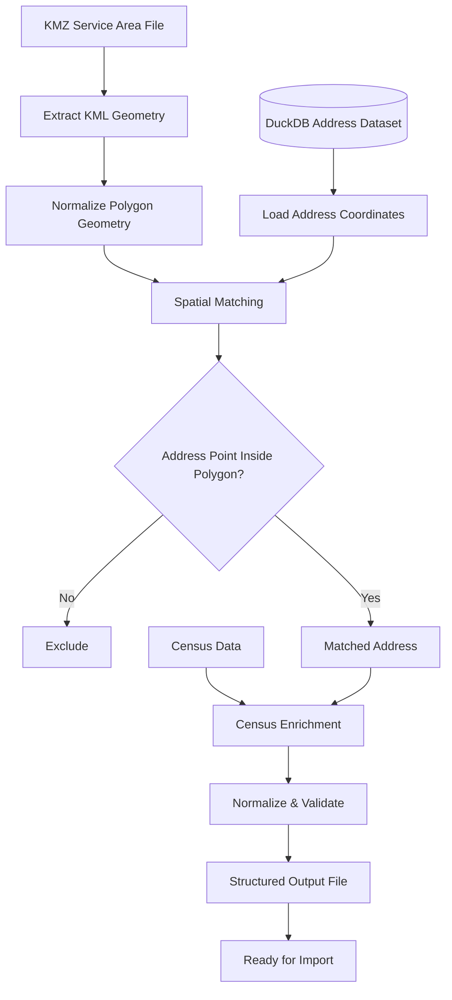

# Fiber Service Area Mapping Pipeline

A geospatial data-processing pipeline built to turn fiber service-area boundaries into structured, address-level datasets that are ready for downstream import.

The program takes KMZ service-area files, compares those polygon boundaries against address coordinates stored in DuckDB, enriches matched locations with Census data, validates the result, and exports a standardized file containing the addresses that fall inside the target service area.

> Production source code and operational datasets are maintained privately because they contain proprietary service-area information, internal address data, and company-specific import logic.

---

## Overview

Broadband service areas are often defined geographically, while marketing, sales, operations, and reporting work at the address level.

That creates a practical question:

> Given a fiber construction or service-area polygon, which physical addresses actually fall inside it?

I built this pipeline to automate that process.

Instead of manually reviewing addresses or trying to match service areas in spreadsheets, the program performs the geographic comparison directly against coordinate data and produces a structured address file ready for use in downstream systems.

---

## What the Pipeline Does



The result is a repeatable process for converting geographic service boundaries into usable address-level data.

---

## Problem It Solves

The source data begins in different forms:

```text
Fiber Service Area
    → KMZ / KML polygon

Address Inventory
    → Structured records with latitude / longitude

Census Data
    → Geographic reference data
```

The pipeline combines them:

```text
Service Area Polygon
        +
Address Coordinates
        +
Census Data
        ↓
Qualified Address Dataset
```

---

## Core Workflow

### 1. KMZ Ingestion

The program accepts KMZ files containing fiber service-area boundaries.

KMZ files contain KML geographic data, so the first stage extracts the geometry needed for spatial processing.

```text
KMZ
 ↓
KML
 ↓
Polygon / MultiPolygon
```

---

### 2. Polygon Processing

The extracted service-area geometry is prepared for spatial comparison.

The workflow can account for:

- Polygon geometry
- MultiPolygon geometry
- Multiple service-area boundaries
- Geographic coordinate data
- Geometry validation

The goal is to create a reliable boundary that can be compared against address points.

---

### 3. Address Data from DuckDB

The address dataset is stored in DuckDB and contains location-level data including geographic coordinates.

Conceptually:

```text
Address Record
├── Location Identifier
├── Address
├── City
├── State
├── ZIP
├── Latitude
└── Longitude
```

DuckDB makes it possible to query and process a large structured dataset without relying on spreadsheet-based workflows.

---

### 4. Point-in-Polygon Matching

Each address coordinate is treated as a geographic point.

The program determines whether that point falls inside the service-area polygon.

```text
Address Latitude / Longitude
          ↓
     Geographic Point
          ↓
Compare Against Fiber Polygon
          ↓
      Inside?
      /    \
    Yes     No
     ↓       ↓
 Include   Exclude
```

Only addresses whose coordinates fall within the target service boundary move forward.

---

## Spatial Join

At a technical level, the workflow performs a point-in-polygon spatial join between the address dataset and the service-area geometry.

A simplified example:

```sql
SELECT
    address_id,
    address_1,
    city,
    state,
    zip,
    latitude,
    longitude
FROM address_source
WHERE ST_Within(
    ST_Point(longitude, latitude),
    service_area_geometry
);
```

This is a public example of the concept, not the production query.

---

## Census Data Enrichment

After an address is matched to the fiber footprint, the record can be enriched with Census-related information.

```text
Matched Address
      +
Census Reference Data
      ↓
Enriched Address Record
```

This gives the output the geographic reference information required by the broader workflow.

---

## Data Normalization

Before export, matched records are normalized into a consistent structure.

This can include:

- Address formatting
- State formatting
- ZIP formatting
- Coordinate validation
- Missing-value handling
- Duplicate handling
- Field ordering
- Column naming
- Data type consistency

The goal is for the final file to be ready for import without another manual cleanup step.

---

## Example Output

A simplified output file might look like:

```csv
location_id,address_1,address_2,city,state,zip,latitude,longitude,territory
100001,101 SAMPLE RD,,EXAMPLE,PA,16900,41.12345,-77.12345,FIBER_AREA_01
100002,205 TEST ST,APT 2,EXAMPLE,PA,16900,41.12422,-77.12193,FIBER_AREA_01
100003,315 DEMO AVE,,EXAMPLE,PA,16900,41.12501,-77.12081,FIBER_AREA_01
```

These records are illustrative only and do not represent production data.

---

## Input → Processing → Output

### Input

```text
KMZ fiber service-area file

DuckDB address dataset
    ├── Address information
    ├── Latitude
    └── Longitude

Census reference data
```

### Processing

```text
Extract geometry
        ↓
Load address coordinates
        ↓
Spatial point-in-polygon match
        ↓
Census enrichment
        ↓
Normalize
        ↓
Validate
        ↓
Deduplicate
```

### Output

```text
Structured address-level dataset
ready for downstream import
```

---

## Example Processing Summary

A run can conceptually produce a summary like:

```text
Service polygons loaded:       2
Address records evaluated:     250,000
Addresses inside polygon:      8,420
Census records matched:        8,401
Records requiring review:      19
Final output records:          8,401
```

These are example numbers only.

---

## Why DuckDB

DuckDB works well for this project because the pipeline needs to analyze a large structured address dataset efficiently without requiring a traditional database server for each processing run.

It is useful for:

- Large local datasets
- SQL-based analysis
- Fast filtering
- Data transformation
- Joining structured files and tables
- Repeatable batch processing

---

## Geospatial Concepts Used

The project uses several geospatial concepts:

- Latitude and longitude
- Point geometries
- Polygon geometries
- MultiPolygon handling
- Point-in-polygon testing
- Spatial joins
- Service-area boundaries
- Coordinate validation
- Geographic enrichment

The map is not the final product. Geography is used to generate operational data.

---

## Data Engineering View

From a data-engineering perspective, this is an ETL pipeline.

### Extract

- KMZ / KML geometry
- DuckDB address records
- Census reference data

### Transform

- Parse service boundaries
- Build geographic points
- Perform spatial matching
- Enrich matched records
- Normalize fields
- Validate data
- Remove invalid or duplicate records

### Load

- Generate a standardized import-ready file

---

## Validation

Several checks happen before a record reaches the final output.

### Geometry Validation

Confirms the imported service boundary can be used for spatial processing.

### Coordinate Validation

Confirms address records contain usable latitude and longitude values.

### Address Validation

Checks that required address fields are present and consistently formatted.

### Census Matching

Checks whether the expected Census information can be associated with the matched record.

### Output Validation

Checks that the final record conforms to the required import schema.

---

## Records Requiring Review

Not every source record can always be processed automatically.

Examples include:

- Missing coordinates
- Invalid coordinates
- Incomplete addresses
- Census mismatches
- Duplicate records
- Unexpected source formatting

Questionable records can be separated from clean output instead of being silently included.

---

## Repeatability

The same pipeline can be reused for new fiber footprints.

```text
New KMZ
   ↓
Run Pipeline
   ↓
New Qualified Address File
```

That removes the need to rebuild the workflow manually for every market.

---

## Practical Use

The resulting data can support:

- Service-area imports
- Territory creation
- Field-sales targeting
- Marketing segmentation
- Address qualification
- Direct-mail targeting
- Market analysis
- Operational reporting

The pipeline acts as the bridge between geographic network data and address-level business workflows.

---

## Technical Documentation

For a deeper look at the project:

- **[System Architecture →](docs/architecture.md)**  
  KMZ/KML ingestion, DuckDB data access, spatial matching, Census enrichment, validation, and export architecture.

- **[Technical Overview →](docs/technical-overview.md)**  
  Detailed implementation concepts covering spatial joins, point-in-polygon processing, geometry handling, normalization, validation, batch processing, and output generation.

---

## My Role

I designed and built the workflow to automate the conversion of fiber service-area boundaries into usable address-level data.

My work included:

- Defining the processing workflow
- KMZ/KML handling
- Geographic polygon processing
- DuckDB data access
- Coordinate-based address matching
- Point-in-polygon logic
- Census data integration
- Data cleanup and normalization
- Validation logic
- Output schema design
- Import-ready file generation
- Testing and troubleshooting

---

## Source Code & Data

The production source code and operational datasets remain private because they contain proprietary service-area information, internal address datasets, company-specific import structures, and operational logic.

This public repository documents the technical approach and data-processing workflow without exposing production data or proprietary implementation details.

---

## Summary

```text
KMZ Fiber Boundary
        +
DuckDB Address Coordinates
        +
Census Data
        ↓
Spatial Matching
        ↓
Validation & Enrichment
        ↓
Structured Address Output
        ↓
Ready for Import
```

What begins as a service-area polygon becomes a structured dataset that can be used directly by marketing, sales, operations, and other downstream systems.
