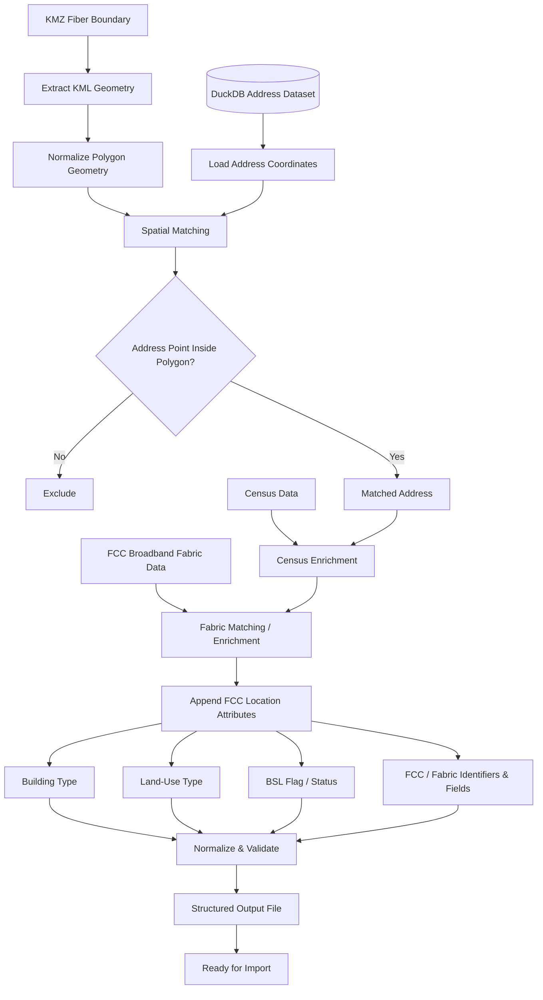

# Fiber Service Area Mapping Pipeline

A geospatial data-processing pipeline built to turn fiber service-area boundaries into structured, enriched address-level datasets that are ready for downstream import.

The program takes KMZ service-area files, compares those polygon boundaries against address coordinates stored in DuckDB, enriches matched locations with Census data, then matches the resulting records against FCC Broadband Fabric data to append location-level attributes such as building type, land-use type, BSL status, and other required Fabric fields.

The final result is a cleaned, validated, standardized file containing the addresses that fall inside the target fiber footprint and the additional geographic and broadband-location attributes needed by downstream systems.

> Production source code and operational datasets are maintained privately because they contain proprietary service-area information, internal address data, licensed or restricted datasets, and company-specific import logic.

---

## Overview

Broadband service areas are often defined geographically, while marketing, sales, operations, engineering, and reporting work at the address level.

That creates a practical question:

> Given a fiber construction or service-area polygon, which physical addresses fall inside it, and what geographic and FCC location attributes belong to those addresses?

I built this pipeline to automate that process.

Instead of manually reviewing addresses or joining several large datasets by hand, the program performs the geographic qualification, enrichment, validation, and export as one repeatable workflow.

---

## What the Pipeline Does



The result is a repeatable process for converting geographic fiber boundaries into qualified and enriched address-level data.

---

## Data Sources

The pipeline brings together four different types of data.

### 1. Fiber Service-Area Geometry

```text
KMZ / KML
    ↓
Polygon / MultiPolygon
```

This defines the geographic footprint being evaluated.

### 2. Address Inventory

```text
DuckDB
├── Location Identifier
├── Address
├── City
├── State
├── ZIP
├── Latitude
└── Longitude
```

This provides the physical address records and coordinates used for spatial matching.

### 3. Census Data

Census reference data is used to append geographic information needed by the broader workflow.

### 4. FCC Broadband Fabric Data

After Census enrichment, the qualified addresses are matched against FCC Broadband Fabric data to append additional location-level attributes.

The specific production fields depend on the import workflow, but examples include:

- FCC / Fabric location identifier
- Building type
- Land-use type
- BSL flag or status
- Other required Fabric attributes

The public showcase intentionally does not expose the production Fabric dataset or internal matching rules.

---

## Problem It Solves

The source data begins in different forms:

```text
Fiber Service Area
    → KMZ / KML polygon

Address Inventory
    → DuckDB records with latitude / longitude

Census Data
    → Geographic reference information

FCC Broadband Fabric
    → Broadband-location attributes
```

The pipeline connects them:

```text
Service Area Polygon
        +
Address Coordinates
        +
Census Data
        +
FCC Fabric Data
        ↓
Qualified + Enriched Address Dataset
```

---

## Core Workflow

### 1. KMZ Ingestion

The program accepts KMZ files containing fiber service-area boundaries.

KMZ files contain KML geographic data, so the first stage extracts the geometry needed for spatial processing.

```text
KMZ
 ↓
KML
 ↓
Polygon / MultiPolygon
```

---

### 2. Polygon Processing

The extracted service-area geometry is prepared for spatial comparison.

The workflow can account for:

- Polygon geometry
- MultiPolygon geometry
- Multiple service-area boundaries
- Geographic coordinate data
- Geometry validation

The goal is to create a reliable boundary that can be compared against address points.

---

### 3. Address Data from DuckDB

The address dataset is stored in DuckDB and contains location-level data including geographic coordinates.

DuckDB makes it possible to query and process a large structured dataset without relying on spreadsheet-based workflows.

---

### 4. Point-in-Polygon Matching

Each address coordinate is treated as a geographic point.

The program determines whether that point falls inside the service-area polygon.

```text
Address Latitude / Longitude
          ↓
     Geographic Point
          ↓
Compare Against Fiber Polygon
          ↓
      Inside?
      /    \
    Yes     No
     ↓       ↓
 Include   Exclude
```

Only addresses whose coordinates fall within the target service boundary move forward.

---

## Spatial Join

At a technical level, the workflow performs a point-in-polygon spatial join between the address dataset and the service-area geometry.

A simplified example:

```sql
SELECT
    address_id,
    address_1,
    city,
    state,
    zip,
    latitude,
    longitude
FROM address_source
WHERE ST_Within(
    ST_Point(longitude, latitude),
    service_area_geometry
);
```

This is a public example of the concept, not the production query.

---

## Census Enrichment

After an address is qualified spatially, the record is enriched with Census-related information.

```text
Matched Address
      +
Census Reference Data
      ↓
Census-Enriched Address
```

This gives the address additional geographic context before the FCC Fabric matching stage.

---

## FCC Broadband Fabric Enrichment

The Census-enriched records are then matched against the FCC Broadband Fabric dataset.

This stage adds broadband-location attributes that are not available from the KMZ boundary, address inventory, or Census data alone.

Conceptually:

```text
Census-Enriched Address
        +
FCC Broadband Fabric
        ↓
Fabric-Matched Address
```

The output can include fields such as:

```text
FCC / Fabric Location ID
Building Type
Land-Use Type
BSL Flag / Status
Other Selected Fabric Attributes
```

This second enrichment stage is important because it turns a geographically qualified address into a record that is also aligned with FCC location-level reference data.

---

## Multi-Source Enrichment

The full record-building process is:

```text
Address Record
     ↓
Inside Fiber Polygon?
     ↓
Census Enrichment
     ↓
FCC Fabric Match
     ↓
Building / Land-Use / BSL Attributes
     ↓
Validated Import Record
```

Each stage contributes a different part of the final record.

---

## Data Normalization

Before export, matched and enriched records are normalized into a consistent structure.

This can include:

- Address formatting
- State formatting
- ZIP formatting
- Coordinate validation
- Census identifier formatting
- FCC / Fabric identifier formatting
- Building-type formatting
- Land-use formatting
- BSL value normalization
- Missing-value handling
- Duplicate handling
- Field ordering
- Column naming
- Data type consistency

The goal is for the final file to be ready for import without another manual cleanup step.

---

## Example Output

A simplified output file might look like:

```csv
location_id,address_1,address_2,city,state,zip,latitude,longitude,census_tract,census_block_group,census_block,fcc_location_id,building_type,land_use_type,bsl_flag,territory
DEMO-0001,101 SAMPLE RD,,EXAMPLE,PA,00000,41.123450,-77.123450,000100,1,1000,FCC-DEMO-1001,SAMPLE_BUILDING_TYPE,SAMPLE_LAND_USE,Y,FIBER_AREA_01
DEMO-0002,205 TEST ST,APT 2,EXAMPLE,PA,00000,41.124220,-77.121930,000100,1,1001,FCC-DEMO-1002,SAMPLE_BUILDING_TYPE,SAMPLE_LAND_USE,Y,FIBER_AREA_01
```

These records and values are synthetic and do not represent production addresses, FCC Fabric records, customers, or service areas.

---

## Input → Processing → Output

### Input

```text
KMZ fiber service-area file

DuckDB address dataset
    ├── Address information
    ├── Latitude
    └── Longitude

Census reference data

FCC Broadband Fabric data
```

### Processing

```text
Extract geometry
        ↓
Load address coordinates
        ↓
Spatial point-in-polygon match
        ↓
Census enrichment
        ↓
FCC Fabric matching
        ↓
Append building / land-use / BSL attributes
        ↓
Normalize
        ↓
Validate
        ↓
Deduplicate
```

### Output

```text
Structured, enriched address-level dataset
ready for downstream import
```

---

## Example Processing Summary

A processing run can conceptually produce a summary like:

```text
Service polygons loaded:        2
Address records evaluated:      250,000
Addresses inside polygon:       8,420
Census records matched:         8,401
FCC Fabric records matched:     8,366
Records requiring review:          35
Final output records:           8,366
```

These are example numbers only.

---

## Why DuckDB

DuckDB works well for this project because the pipeline needs to analyze a large structured address dataset efficiently without requiring a traditional database server for each processing run.

It is useful for:

- Large local datasets
- SQL-based analysis
- Fast filtering
- Data transformation
- Joining structured files and tables
- Repeatable batch processing

---

## Geospatial Concepts Used

The project uses several geospatial concepts:

- Latitude and longitude
- Point geometries
- Polygon geometries
- MultiPolygon handling
- Point-in-polygon testing
- Spatial joins
- Service-area boundaries
- Coordinate validation
- Geographic enrichment

The map itself is not the final product. Geography is used to create structured operational data.

---

## Data Engineering View

From a data-engineering perspective, this is a multi-source geospatial ETL pipeline.

### Extract

- KMZ / KML geometry
- DuckDB address records
- Census reference data
- FCC Broadband Fabric data

### Transform

- Parse service boundaries
- Build geographic points
- Perform spatial matching
- Enrich with Census data
- Match against FCC Fabric
- Append FCC location attributes
- Normalize fields
- Validate data
- Remove invalid or duplicate records

### Load

- Generate a standardized import-ready file

---

## Validation

Several checks happen before a record reaches the final output.

### Geometry Validation

Confirms the imported service boundary can be used for spatial processing.

### Coordinate Validation

Confirms address records contain usable latitude and longitude values.

### Address Validation

Checks that required address fields are present and consistently formatted.

### Census Validation

Checks whether the expected Census reference information can be associated with the matched record.

### FCC Fabric Validation

Checks whether required FCC / Fabric attributes were matched and appended correctly.

### Output Validation

Checks that the final record conforms to the required import schema.

---

## Records Requiring Review

Not every source record can always be processed automatically.

Examples include:

- Missing coordinates
- Invalid coordinates
- Incomplete addresses
- Census mismatches
- FCC Fabric mismatches
- Missing required Fabric attributes
- Duplicate records
- Unexpected source formatting

Questionable records can be separated from clean output instead of being silently included.

---

## Repeatability

The same pipeline can be reused for new fiber footprints.

```text
New KMZ
   ↓
Run Pipeline
   ↓
New Qualified + Enriched Address File
```

That removes the need to rebuild the workflow manually for every market.

---

## Practical Use

The resulting data can support:

- Service-area imports
- Territory creation
- Field-sales targeting
- Marketing segmentation
- Address qualification
- Direct-mail targeting
- Broadband-location analysis
- FCC data reconciliation
- Market analysis
- Operational reporting

The pipeline acts as the bridge between geographic network data and address-level business workflows.

---

## Technical Documentation

For a deeper look at the project:

- **[System Architecture →](docs/architecture.md)**  
  KMZ/KML ingestion, DuckDB data access, spatial matching, Census enrichment, FCC Fabric enrichment, validation, and export architecture.

- **[Technical Overview →](docs/technical-overview.md)**  
  Detailed implementation concepts covering spatial joins, point-in-polygon processing, geometry handling, multi-source enrichment, FCC Fabric matching, normalization, validation, batch processing, and output generation.

- **[Synthetic Example Output →](examples/sample-output.csv)**  
  A public-safe example of the kind of enriched address-level file produced by the pipeline.

---

## My Role

I designed and built the workflow to automate the conversion of fiber service-area boundaries into usable, enriched address-level data.

My work included:

- Defining the processing workflow
- KMZ/KML handling
- Geographic polygon processing
- DuckDB data access
- Coordinate-based address matching
- Point-in-polygon logic
- Census data integration
- FCC Broadband Fabric matching
- FCC location attribute enrichment
- Building-type and land-use field handling
- BSL flag / status handling
- Data cleanup and normalization
- Validation logic
- Output schema design
- Import-ready file generation
- Testing and troubleshooting

---

## Source Code & Data

The production source code and operational datasets remain private because they contain proprietary service-area information, internal address datasets, licensed or restricted reference data, company-specific import structures, and operational logic.

This public repository documents the technical approach and data-processing workflow without exposing production data or proprietary implementation details.

---

## Summary

```text
KMZ Fiber Boundary
        +
DuckDB Address Coordinates
        ↓
Spatial Matching
        ↓
Census Enrichment
        ↓
FCC Broadband Fabric Enrichment
        ↓
Building Type / Land Use / BSL / Fabric Fields
        ↓
Validation & Normalization
        ↓
Structured Address Output
        ↓
Ready for Import
```

What begins as a service-area polygon becomes a qualified, enriched dataset that combines address-level geography, Census information, and FCC Broadband Fabric attributes for direct use in downstream systems.
