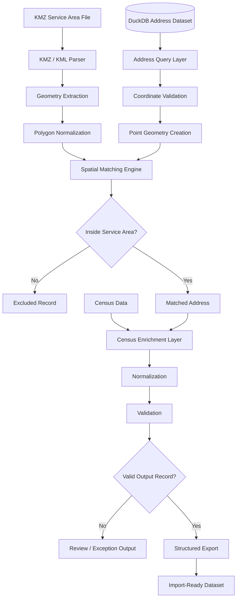
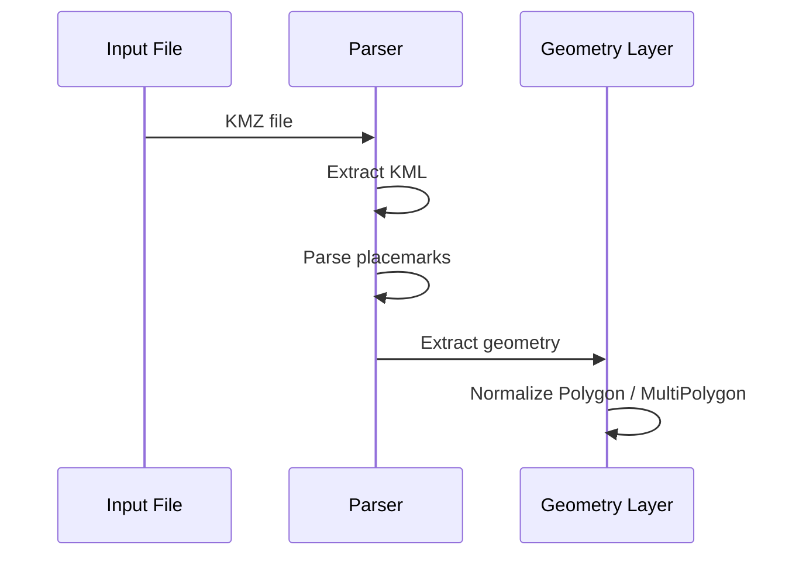
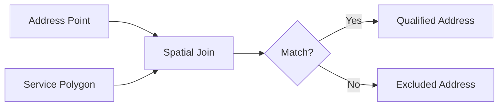
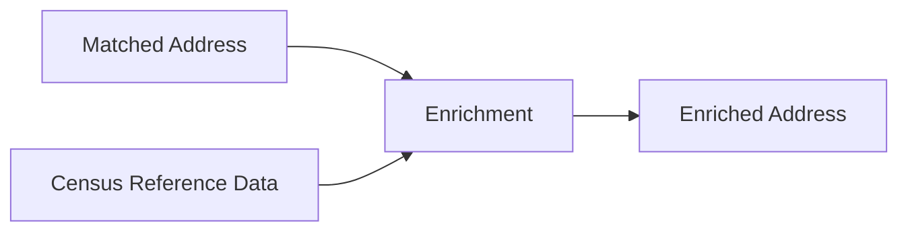
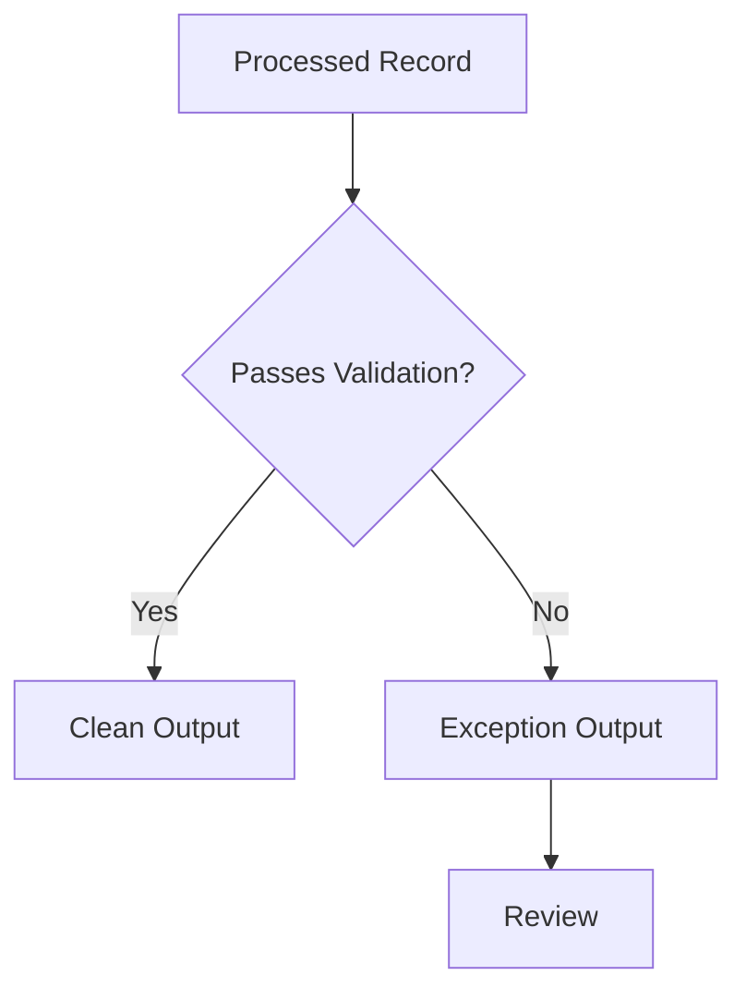
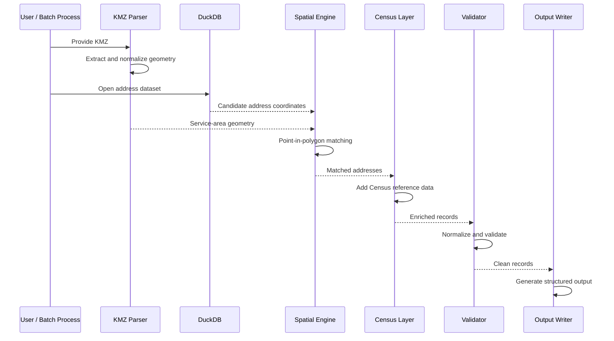

# Fiber Service Area Mapping Pipeline — System Architecture

## Purpose

The Fiber Service Area Mapping Pipeline converts geographic fiber service-area boundaries into structured address-level datasets.

The system accepts KMZ/KML service-area files, loads address records with latitude and longitude from DuckDB, performs spatial point-in-polygon matching, enriches matched records with Census data, validates the result, and exports a standardized file ready for downstream import.

This document explains the architecture at a public portfolio level. Production datasets, proprietary service-area information, exact internal schemas, private file locations, and company-specific import rules are intentionally excluded.

---

## High-Level Architecture



The architecture is designed around one central transformation:

```text
Geographic Boundary
        +
Address Coordinates
        +
Census Reference Data
        ↓
Qualified Address Dataset
```

---

# 1. Input Layer

The pipeline accepts three primary categories of input:

1. Service-area geometry
2. Address location data
3. Census reference data

Each input serves a different purpose.

---

## Service-Area Geometry

The service-area input is supplied as a KMZ file.

KMZ is a compressed container around KML content.

Conceptually:

```text
KMZ
 ↓
KML
 ↓
Placemark
 ↓
Geometry
 ↓
Polygon / MultiPolygon
```

The parser extracts only the geographic information required for downstream spatial processing.

---

## Address Dataset

The address dataset is stored in DuckDB.

Each address record contains structured location data such as:

```text
Location Identifier
Address Line 1
Address Line 2
City
State
ZIP
Latitude
Longitude
```

The exact production schema contains additional fields that are not included in this public documentation.

---

## Census Reference Data

Census data provides geographic reference information used to enrich matched locations.

The exact fields depend on the downstream workflow, but conceptually Census data can provide identifiers or geographic classifications associated with an address location.

---

# 2. KMZ / KML Parsing Layer

The first processing stage converts the KMZ input into usable geometry.

A simplified sequence is:



The result is a geometry object suitable for spatial operations.

---

# 3. Geometry Types

Service-area KMZ files can contain more than one type of polygon geometry.

The pipeline therefore needs to account for:

- Polygon
- MultiPolygon
- Multiple placemarks
- Multiple disconnected service areas

Conceptually:

```text
KMZ
├── Polygon A
├── Polygon B
└── MultiPolygon C
```

Each valid boundary can participate in the matching process.

---

# 4. Geometry Normalization

Raw source geometry may require normalization before spatial matching.

Normalization can include:

- Converting equivalent geometry forms into one internal representation
- Validating polygon structure
- Handling multiple rings
- Preserving holes where present
- Combining compatible boundaries
- Rejecting malformed geometry

The objective is to ensure that downstream spatial logic works against predictable geometry.

---

# 5. Coordinate Reference System

Spatial matching only works correctly when the point coordinates and polygon coordinates use compatible reference systems.

Address coordinates are typically represented as longitude and latitude.

Conceptually:

```text
Longitude = X
Latitude  = Y
```

The pipeline must maintain consistent coordinate order.

A common source of geospatial bugs is accidentally reversing latitude and longitude.

---

# 6. Address Query Layer

DuckDB serves as the primary analytical store for address records.

The pipeline queries only the fields required for the matching and export workflow.

A simplified query might conceptually retrieve:

```sql
SELECT
    location_id,
    address_1,
    address_2,
    city,
    state,
    zip,
    latitude,
    longitude
FROM address_source
WHERE latitude IS NOT NULL
  AND longitude IS NOT NULL;
```

This is a public example, not the production query.

---

# 7. Why DuckDB Fits the Architecture

The project benefits from DuckDB because the workload is primarily analytical and batch-oriented.

DuckDB provides:

- SQL-based filtering
- Efficient local execution
- Fast scans over large datasets
- Strong support for analytical queries
- Lightweight deployment
- Easy integration with structured files

This avoids moving large address datasets into spreadsheets or manually processing them row by row.

---

# 8. Coordinate Validation

Before an address can participate in spatial matching, its coordinates must be usable.

Validation can include:

```text
Latitude exists
Longitude exists
Latitude in valid range
Longitude in valid range
Values are numeric
```

Conceptually:

```text
-90 <= latitude <= 90
-180 <= longitude <= 180
```

Records that fail coordinate validation are separated from clean spatial input.

---

# 9. Point Geometry Creation

Each valid address coordinate pair is converted into a geographic point.

```text
longitude + latitude
        ↓
   POINT(x y)
```

Conceptually:

```text
POINT(-77.12345 41.12345)
```

These points are then evaluated against the service-area polygon geometry.

---

# 10. Spatial Matching Engine

The central geospatial operation is a point-in-polygon test.

For each address:

```text
Address Point
     ↓
Service Polygon
     ↓
Inside?
```

If the point falls inside the polygon, the address qualifies for the target service area.

If it falls outside, it is excluded.

---

# 11. Spatial Join Model

Conceptually, the relationship is:



A simplified SQL-style representation might look like:

```sql
SELECT
    a.*
FROM addresses a
JOIN service_area s
  ON ST_Within(
      ST_Point(a.longitude, a.latitude),
      s.geometry
  );
```

This is illustrative and not the production implementation.

---

# 12. Boundary Behavior

One subtle geospatial question is how to treat points that lie exactly on the service-area boundary.

Different spatial predicates can behave differently.

Possible behaviors include:

```text
Inside only
Inside or touching boundary
Intersecting geometry
```

The chosen predicate should match the operational definition of service-area inclusion.

The exact production rule is not disclosed in this public document.

---

# 13. Multiple Polygon Handling

A KMZ can contain more than one qualifying polygon.

The system can conceptually evaluate:

```text
Address Point
   ↓
Polygon A?
   ↓
Polygon B?
   ↓
Polygon C?
```

or use a combined geometry representation.

The result should include each qualifying address only once unless the downstream workflow explicitly requires otherwise.

---

# 14. Duplicate Prevention

Duplicate addresses can appear because of:

- Overlapping polygons
- Duplicate source records
- Duplicate geographic points
- Repeated location identifiers

The pipeline therefore includes duplicate handling before final export.

Deduplication can be based on one or more stable fields such as:

```text
Location Identifier
Address Key
Coordinate Pair
```

The exact production rule depends on the underlying dataset.

---

# 15. Spatial Matching Output

After the spatial stage, matched records conceptually look like:

```text
Matched Address
├── Location Identifier
├── Address
├── City
├── State
├── ZIP
├── Latitude
├── Longitude
└── Service-Area Match
```

These records then move into Census enrichment.

---

# 16. Census Enrichment Layer

The Census enrichment stage joins matched address records with geographic reference data.

Conceptually:



This allows the pipeline to attach the Census-related information required by downstream systems.

---

# 17. Census Join Strategy

Depending on the available reference data, Census enrichment can conceptually rely on:

- Geographic identifiers
- Coordinates
- Precomputed location relationships
- Other stable location keys

The important architectural principle is that Census enrichment happens after service-area qualification, so unnecessary enrichment work is avoided for addresses outside the target polygon.

---

# 18. Data Normalization Layer

After spatial matching and enrichment, the output is normalized into a consistent schema.

Normalization can include:

- Uppercasing state codes
- Standardizing ZIP format
- Preserving address line separation
- Cleaning whitespace
- Converting null representations
- Ordering columns
- Enforcing field names
- Standardizing data types

This ensures the same downstream format regardless of source-file differences.

---

# 19. Output Schema Enforcement

The pipeline does not simply dump query results.

It produces records that conform to a defined import schema.

Conceptually:

```text
Raw Matched Record
      ↓
Field Mapping
      ↓
Type Conversion
      ↓
Required-Field Validation
      ↓
Output Schema
```

This makes the export deterministic and predictable.

---

# 20. Required Fields

Typical output validation can require fields such as:

```text
Location Identifier
Address
City
State
ZIP
Latitude
Longitude
```

Additional required fields depend on the downstream system.

Records missing required fields can be routed to review rather than included in the clean export.

---

# 21. Exception Handling

The pipeline separates clean output from records that need investigation.

Conceptually:



Common exception causes include:

- Missing coordinates
- Invalid coordinate ranges
- Malformed geometry
- Missing required address fields
- Census mismatch
- Duplicate key
- Unsupported source structure

---

# 22. Error Categories

Categorizing errors makes the pipeline easier to troubleshoot.

Examples include:

```text
KMZ_PARSE_ERROR
INVALID_GEOMETRY
INVALID_COORDINATE
MISSING_ADDRESS
DUPLICATE_RECORD
CENSUS_MATCH_FAILURE
OUTPUT_SCHEMA_FAILURE
```

The exact implementation may use different names.

---

# 23. Batch Processing Model

The system is designed for repeatable batch processing.

A typical run is:

```text
Select KMZ
   ↓
Load Address Source
   ↓
Run Spatial Match
   ↓
Enrich
   ↓
Validate
   ↓
Export
```

This makes it suitable for processing multiple fiber markets or construction footprints over time.

---

# 24. Repeatable Market Processing

The pipeline can be reused without rewriting the logic for each market.

```text
Market A KMZ
     ↓
Same Pipeline
     ↓
Market A Output

Market B KMZ
     ↓
Same Pipeline
     ↓
Market B Output
```

Only the input boundary and market-specific configuration need to change.

---

# 25. Performance Architecture

The pipeline can process large address datasets more efficiently by reducing work at each stage.

Performance strategies can include:

- Query only required columns
- Filter invalid coordinates early
- Reduce candidate records before expensive processing
- Use SQL-based filtering
- Avoid repeated parsing
- Deduplicate after matching
- Enrich only qualified addresses

The order of operations matters.

---

# 26. Processing Order

A good pipeline avoids expensive operations on records that will eventually be discarded.

Conceptually:

```text
Raw Addresses
      ↓
Coordinate Validation
      ↓
Spatial Qualification
      ↓
Census Enrichment
      ↓
Output Transformation
```

Performing Census enrichment before spatial qualification would waste work on addresses outside the service area.

---

# 27. Spatial Prefiltering

For very large datasets, a coarse geographic prefilter can reduce the number of points requiring full point-in-polygon evaluation.

Conceptually:

```text
Polygon Bounding Box
        ↓
Filter Address Coordinates
        ↓
Smaller Candidate Set
        ↓
Exact Point-in-Polygon Test
```

This is a common optimization pattern in geospatial systems.

---

# 28. Bounding Box Concept

A service polygon has an outer geographic extent:

```text
minimum longitude
maximum longitude
minimum latitude
maximum latitude
```

Addresses clearly outside that range can be rejected before detailed geometry checks.

The exact optimization approach depends on the production implementation.

---

# 29. Memory Considerations

Address datasets can become too large for naive all-in-memory processing.

DuckDB helps by keeping the workflow query-oriented.

The pipeline can avoid constructing large Python objects for every row when SQL can perform the filtering more efficiently.

This reduces memory pressure and improves repeatability.

---

# 30. Data Lineage

A useful pipeline should preserve enough information to understand where an output record came from.

Conceptually:

```text
Output Record
├── Source Address Record
├── Source Service Polygon
├── Census Enrichment Source
└── Processing Run
```

This makes troubleshooting much easier when a downstream user questions why an address was included.

---

# 31. Run Metadata

Each processing run can conceptually track metadata such as:

```text
Run timestamp
Input KMZ name
Polygon count
Address source version
Records evaluated
Records matched
Records rejected
Output row count
```

Public showcase documentation uses example values rather than production totals.

---

# 32. Output Generation

After validation, clean records are written to the required export format.

Typical formats can include CSV or another structured flat-file format.

Conceptually:

```text
Validated Records
      ↓
Column Ordering
      ↓
Serialization
      ↓
Output File
```

The output is designed for machine import rather than manual editing.

---

# 33. Deterministic Output

A good import pipeline should produce predictable results.

Given the same:

- KMZ
- Address dataset
- Census source
- Configuration

the pipeline should produce the same qualified output.

This makes testing and troubleshooting much easier.

---

# 34. Example End-to-End Flow



---

# 35. Architectural Separation

The system can be thought of as several logical layers:

```text
Input Layer
    ↓
Geometry Layer
    ↓
Address Query Layer
    ↓
Spatial Layer
    ↓
Enrichment Layer
    ↓
Validation Layer
    ↓
Export Layer
```

Each layer has a narrow responsibility.

That separation makes the pipeline easier to maintain and test.

---

# 36. Testing Strategy

Testing should cover both data-processing correctness and geospatial correctness.

Important areas include:

- KMZ extraction
- KML parsing
- Polygon parsing
- MultiPolygon handling
- Coordinate order
- Point-in-polygon matching
- Boundary cases
- Duplicate handling
- Census enrichment
- Output schema
- Missing fields
- Invalid records

---

# 37. Geometry Tests

Geometry tests can use known shapes and points.

Example:

```text
Square Polygon
├── Point clearly inside → Include
├── Point clearly outside → Exclude
└── Point on boundary → Expected policy
```

Small deterministic test geometries make spatial behavior easier to verify.

---

# 38. Data Tests

Data tests can verify:

```text
Valid address → exported
Missing coordinate → rejected
Invalid ZIP → normalized or rejected
Duplicate key → handled correctly
Missing required field → review output
```

These tests ensure the export is reliable.

---

# 39. Regression Testing

Changes to geospatial or normalization logic can subtly alter output.

Regression tests can compare known input fixtures against expected results.

This is especially useful when modifying:

- Geometry parsing
- Census joins
- Deduplication rules
- Output schema
- Coordinate logic

---

# 40. Security and Privacy

The pipeline works with proprietary service-area and address information.

Public documentation intentionally excludes:

- Production KMZ files
- Internal address datasets
- Exact Census source configuration
- Company-specific import schema details
- Internal identifiers
- Private file locations
- Production output files

Any example records in the public showcase use synthetic data.

---

# 41. Why the Source Remains Private

The value of the public showcase is to demonstrate:

- Geospatial processing
- DuckDB-based data engineering
- Spatial joins
- Census enrichment
- Validation
- ETL design
- Output generation

It is not necessary to expose proprietary service footprints or internal address inventory to demonstrate those skills.

---

# 42. Architectural Principles

## 1. Treat Geography as Data

The KMZ is not simply a visual map file; it is a machine-readable service boundary.

## 2. Validate Early

Invalid geometry and coordinates should be rejected before expensive processing.

## 3. Reduce the Candidate Set

Only perform detailed spatial work on records that could plausibly match.

## 4. Enrich After Qualification

Census work should occur after addresses have passed service-area matching.

## 5. Separate Clean Output from Exceptions

Questionable records should not silently enter the import file.

## 6. Enforce a Stable Output Schema

Downstream systems should receive predictable columns and data types.

## 7. Preserve Repeatability

The same inputs should produce the same output.

## 8. Keep Production Data Private

Public documentation explains the engineering without exposing proprietary geography or address data.

---

# Public Documentation Scope

This document intentionally includes:

- KMZ/KML processing architecture
- Geometry normalization
- DuckDB data access
- Coordinate validation
- Point-in-polygon matching
- Spatial joins
- Census enrichment
- Deduplication
- Validation
- Export design
- Performance considerations
- Testing strategy

It intentionally excludes:

- Production service-area polygons
- Internal address databases
- Exact production queries
- Exact Census mappings
- Company-specific import rules
- Production output files
- Proprietary identifiers

---

## Summary

The architecture turns geographic fiber boundaries into operational data through a controlled geospatial ETL workflow.

```text
KMZ / KML
    ↓
Geometry
    ↓
DuckDB Address Coordinates
    ↓
Spatial Join
    ↓
Qualified Addresses
    ↓
Census Enrichment
    ↓
Normalization & Validation
    ↓
Import-Ready Output
```

The project demonstrates how geospatial data, analytical SQL, address datasets, and structured export logic can be combined to solve a practical broadband operations and marketing problem.
