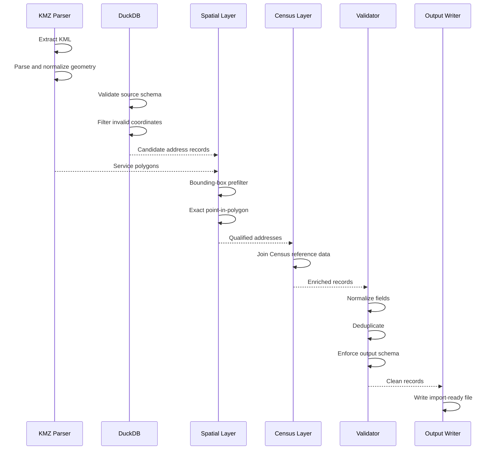

# Fiber Service Area Mapping Pipeline — Technical Overview

## Introduction

The Fiber Service Area Mapping Pipeline is a geospatial ETL workflow built to convert fiber service-area boundaries into structured, address-level datasets.

The system takes KMZ/KML polygon data, compares it against address coordinates stored in DuckDB, enriches matched locations with Census data, validates and normalizes the results, and produces an import-ready output file.

This document focuses on implementation concepts and engineering decisions. Production datasets, private service-area files, exact internal schemas, proprietary import rules, and company-specific logic are intentionally excluded.

---

## 1. Technology and Data Stack

| Area | Technology / Data Type | Responsibility |
|---|---|---|
| Service Area Input | KMZ / KML | Geographic fiber boundaries |
| Analytical Store | DuckDB | Address-level structured data |
| Query Language | SQL | Filtering, transformation, joins |
| Geospatial Logic | Point / Polygon operations | Service-area qualification |
| Reference Data | Census data | Geographic enrichment |
| Processing | Batch ETL workflow | Match, enrich, validate, export |
| Output | Structured flat file | Downstream import |

The project is designed around analytical batch processing rather than a user-facing application.

---

## 2. Processing Model

The workflow is best understood as a geospatial ETL pipeline.

```text
Extract
  ↓
Transform
  ↓
Spatial Match
  ↓
Enrich
  ↓
Validate
  ↓
Load / Export
```

At a high level:

```text
KMZ Fiber Boundary
        +
DuckDB Address Coordinates
        +
Census Data
        ↓
Geospatial Processing
        ↓
Structured Address Output
```

---

## 3. KMZ and KML Handling

KMZ is a compressed archive format that commonly contains KML geographic data.

The pipeline begins by extracting the KML content from the KMZ container.

Conceptually:

```text
fiber_area.kmz
      ↓
Archive Extraction
      ↓
doc.kml
      ↓
Placemark / Geometry Parsing
```

The parser locates the relevant geometric features rather than treating the file as a visual-only map.

---

## 4. Geometry Extraction

KML can contain several geometry types.

The workflow primarily focuses on:

- Polygon
- MultiPolygon
- Multiple placemarks
- Multiple disconnected service areas

Conceptually:

```text
KML Document
├── Placemark A
│   └── Polygon
├── Placemark B
│   └── Polygon
└── Placemark C
    └── MultiGeometry
```

The pipeline extracts the polygonal geometry required for service-area matching.

---

## 5. Polygon Normalization

Source geometry is normalized before use.

Normalization can include:

- Converting Polygon and MultiPolygon into a consistent internal representation
- Preserving polygon rings
- Preserving holes
- Combining multiple service areas where appropriate
- Rejecting malformed geometry
- Handling empty geometry
- Verifying coordinate structure

The downstream spatial code should not need to know every variation that appeared in the original KMZ.

---

## 6. Coordinate Order

One of the easiest geospatial mistakes is reversing latitude and longitude.

The point order is:

```text
X = longitude
Y = latitude
```

So an address at:

```text
Latitude:  41.12345
Longitude: -77.12345
```

becomes conceptually:

```text
POINT(-77.12345 41.12345)
```

Maintaining coordinate order consistently is essential for correct spatial results.

---

## 7. Coordinate Validation

Address records are checked before geometry creation.

Typical validation includes:

```text
latitude is not null
longitude is not null
latitude is numeric
longitude is numeric
-90 <= latitude <= 90
-180 <= longitude <= 180
```

Invalid coordinates should be excluded before the spatial join.

This avoids wasting time on records that cannot produce meaningful geometry.

---

## 8. DuckDB Query Strategy

DuckDB is used as the analytical engine for the address dataset.

The pipeline benefits from pushing filtering and transformation into SQL rather than loading every address into application memory.

A simplified query might look like:

```sql
SELECT
    location_id,
    address_1,
    address_2,
    city,
    state,
    zip,
    latitude,
    longitude
FROM address_source
WHERE latitude IS NOT NULL
  AND longitude IS NOT NULL;
```

This example is illustrative only.

---

## 9. Why DuckDB

DuckDB is a good fit because the workload is:

- Read-heavy
- Analytical
- Batch-oriented
- SQL-driven
- Local or file-based
- Potentially large

It provides fast scans and joins without requiring a continuously running database server.

That makes it well suited for repeatable geospatial data processing.

---

## 10. Projection and CRS Awareness

Spatial operations require compatible coordinate reference systems.

The service polygon and address points must represent coordinates in the same geographic system before matching.

The pipeline therefore needs to ensure:

```text
Polygon CRS
     =
Point CRS
```

If source data uses different systems, reprojection would be required before point-in-polygon testing.

The exact production CRS handling is intentionally omitted from this public document.

---

## 11. Point Geometry Creation

Valid address coordinates are converted to point geometries.

Conceptually:

```sql
ST_Point(longitude, latitude)
```

This turns a structured address row into a spatial object that can participate in geographic predicates.

---

## 12. Point-in-Polygon Logic

The central operation determines whether an address point is inside the service-area polygon.

Conceptually:

```sql
ST_Within(
    address_point,
    service_polygon
)
```

or an equivalent predicate depending on boundary policy.

This step converts a geographic footprint into a list of qualified addresses.

---

## 13. Spatial Join

The pipeline can be expressed as a spatial join between address points and service polygons.

A simplified example:

```sql
SELECT
    a.*
FROM addresses a
JOIN service_areas s
  ON ST_Within(
      ST_Point(a.longitude, a.latitude),
      s.geometry
  );
```

The production query may use additional filtering, metadata, or spatial functions.

---

## 14. Boundary Semantics

A subtle implementation detail is whether points exactly on the polygon edge are included.

Possible predicates can differ:

```text
Within
Contains
Intersects
Covers
```

The chosen operation should reflect the business definition of “inside the service area.”

This is important because boundary behavior can affect addresses that lie exactly along construction or franchise edges.

---

## 15. Bounding-Box Prefiltering

For large datasets, a coarse bounding-box filter can reduce the number of address points evaluated by the full spatial predicate.

Conceptually:

```text
Service Polygon
      ↓
Bounding Box
      ↓
Candidate Address Filter
      ↓
Exact Point-in-Polygon
```

A bounding box is defined by:

```text
min_longitude
max_longitude
min_latitude
max_latitude
```

Addresses outside that rectangle cannot be inside the polygon.

---

## 16. Why Prefiltering Matters

Point-in-polygon checks are more expensive than simple numeric comparisons.

If a DuckDB dataset contains hundreds of thousands or millions of rows, prefiltering can significantly reduce the candidate set.

Example:

```text
All address records:      1,000,000
Bounding-box candidates:     35,000
Exact polygon matches:        8,400
```

These numbers are illustrative only.

---

## 17. MultiPolygon Handling

A fiber footprint may contain disconnected geographic areas.

Conceptually:

```text
Service Area
├── Polygon 1
├── Polygon 2
└── Polygon 3
```

The pipeline needs to evaluate an address against the full service-area geometry rather than only the first polygon encountered.

---

## 18. Overlapping Polygons

Different source polygons can overlap.

Without deduplication, the same address can match multiple polygons and appear more than once.

The pipeline therefore needs to ensure that a final qualified location is unique according to the intended business key.

---

## 19. Deduplication Strategy

Potential keys include:

```text
Location ID
Normalized address key
Coordinate pair
Composite market + location key
```

The most reliable key is generally a stable source identifier when one exists.

Deduplication should happen before final export.

---

## 20. Address Normalization

Address fields can contain formatting inconsistencies.

Normalization can include:

- Trimming whitespace
- Standardizing null values
- Normalizing state abbreviations
- Standardizing ZIP formatting
- Preserving apartment / unit fields
- Enforcing consistent capitalization where required

The goal is predictable downstream ingestion.

---

## 21. ZIP Handling

ZIP data can be problematic because spreadsheet-style tools often treat ZIP codes as numbers.

That can remove leading zeros.

The pipeline should treat ZIP values as strings when leading zeros must be preserved.

Conceptually:

```text
"01234"  ✅
1234     ❌
```

---

## 22. Census Enrichment

Once an address has qualified spatially, the record can be joined to Census reference data.

The pipeline intentionally enriches only matched addresses rather than the entire source dataset.

This reduces unnecessary processing.

---

## 23. Census Join Approaches

Depending on the data available, enrichment can conceptually use:

- Geographic identifiers
- Coordinate relationships
- Existing crosswalk keys
- Tract / block relationships
- Location IDs

The exact production join logic is private.

---

## 24. Why Enrichment Comes After Spatial Matching

The ordering matters.

Less efficient:

```text
All Addresses
    ↓
Census Enrichment
    ↓
Spatial Match
```

More efficient:

```text
All Addresses
    ↓
Spatial Match
    ↓
Smaller Matched Set
    ↓
Census Enrichment
```

This reduces work on addresses that will not be included anyway.

---

## 25. Output Transformation

Matched and enriched records are mapped into the schema expected by the downstream system.

Conceptually:

```text
Source Fields
      ↓
Field Mapping
      ↓
Renaming
      ↓
Type Conversion
      ↓
Required Field Ordering
      ↓
Export Schema
```

This is what turns an analysis result into an operationally useful file.

---

## 26. Schema Enforcement

The output should be deterministic.

A schema definition can specify:

- Column names
- Column order
- Data types
- Required fields
- Optional fields
- Null behavior

This reduces the risk that an output file changes shape unexpectedly between runs.

---

## 27. Example Export Schema

A simplified example:

```text
location_id
address_1
address_2
city
state
zip
latitude
longitude
territory
```

The production schema may contain additional fields.

---

## 28. Output Validation

Before writing the final file, the pipeline can validate:

```text
Required columns exist
Required values are populated
Coordinates are valid
Duplicate keys are removed
Data types are correct
Column order is correct
```

Only clean records should appear in the import-ready output.

---

## 29. Exception Dataset

Records that fail validation should not simply disappear.

A separate exception dataset can contain:

```text
source_record
error_type
error_message
processing_stage
```

This provides a controlled review process.

---

## 30. Error Categories

Useful categories can include:

```text
KMZ_PARSE_ERROR
INVALID_GEOMETRY
INVALID_COORDINATE
MISSING_REQUIRED_FIELD
DUPLICATE_RECORD
CENSUS_MATCH_FAILURE
OUTPUT_SCHEMA_ERROR
```

Categorization makes troubleshooting faster.

---

## 31. Processing Summary

A processing run can return a structured summary such as:

```text
KMZ files processed
Polygons extracted
Address rows scanned
Candidate rows
Spatial matches
Census matches
Duplicates removed
Exceptions
Final output rows
```

This helps validate that the run behaved as expected.

---

## 32. Run-Level Validation

Counts are useful for catching unexpected results.

For example:

```text
Previous run: 8,400 matches
Current run:      14 matches
```

That difference may be valid, but it should trigger a review of the input polygon or source dataset.

---

## 33. Deterministic Processing

Given the same:

- KMZ
- DuckDB dataset
- Census data
- Configuration
- Code version

the pipeline should produce the same output.

Determinism makes testing and debugging much easier.

---

## 34. Batch Processing

The program is designed for repeatable runs rather than interactive UI usage.

A typical batch sequence is:

```text
Input File
   ↓
Process
   ↓
Validate
   ↓
Write Output
   ↓
Write Summary
```

This design is appropriate for market-by-market service-area processing.

---

## 35. Reusable Market Workflow

The pipeline is not hard-coded to one service area.

Conceptually:

```text
Canton Fiber KMZ
       ↓
Same Engine
       ↓
Canton Address Output

Another Market KMZ
       ↓
Same Engine
       ↓
Another Market Output
```

Only the input geometry and associated configuration change.

---

## 36. Data Volume

The pipeline may need to process large address datasets.

Efficient handling depends on:

- Column projection
- Filtering early
- Avoiding unnecessary Python loops
- SQL execution in DuckDB
- Spatial prefiltering
- Processing only qualified rows downstream

---

## 37. Avoiding Row-by-Row Python

For large datasets, row-by-row Python loops can become a bottleneck.

Where possible, set-based operations are preferable.

Conceptually:

```text
SQL filter / join
    ↓
Vectorized / set-based processing
```

rather than:

```text
for each row:
    do expensive work
```

---

## 38. DuckDB Spatial Operations

Where spatial functionality is available, DuckDB can participate directly in spatial processing.

Conceptually:

```sql
LOAD spatial;

SELECT ...
FROM ...
WHERE ST_Within(...);
```

This reduces data movement between SQL and external processing layers.

The exact production implementation is intentionally not disclosed.

---

## 39. Hybrid Processing

A pipeline can also use a hybrid approach:

```text
DuckDB
   ↓
Coarse filtering / structured joins
   ↓
Geospatial library
   ↓
Exact geometry operations
```

The best design depends on data size, available extensions, and deployment environment.

---

## 40. Memory Efficiency

Large datasets should not be loaded entirely into memory unless necessary.

DuckDB allows query execution over data without materializing every record in application memory.

This makes the workflow more reliable on standard development machines.

---

## 41. Temporary Data

Intermediate processing can produce temporary datasets such as:

```text
candidate_addresses
matched_addresses
enriched_addresses
exceptions
```

These can be represented as temporary tables, views, or transient processing frames.

Keeping intermediate stages explicit can improve debugging.

---

## 42. Data Lineage

Each final record should be traceable back to its inputs.

Conceptually:

```text
Final Output Record
├── Address source row
├── Service-area geometry
├── Census enrichment source
└── Processing run
```

This helps answer why a record was included.

---

## 43. Run Metadata

A run can capture:

```text
run_id
timestamp
input_filename
polygon_count
source_dataset_version
address_rows_scanned
match_count
exception_count
output_count
```

Production details remain private, but this pattern supports traceability.

---

## 44. Logging

Useful logs can include:

- File loaded
- Geometry count
- Candidate row count
- Match count
- Enrichment status
- Exception count
- Output location
- Processing duration

Logs should avoid unnecessarily exposing sensitive address data.

---

## 45. Timing Metrics

Performance measurements can identify slow stages.

Example:

```text
KMZ parsing:           0.4 sec
DuckDB filtering:      1.8 sec
Spatial matching:      4.7 sec
Census enrichment:     2.1 sec
Output validation:     0.8 sec
Export:                0.6 sec
```

These values are illustrative.

---

## 46. Geometry Edge Cases

Geospatial data can contain unusual cases such as:

- Self-intersecting polygons
- Empty geometry
- Duplicate rings
- Polygon holes
- Very small sliver polygons
- Invalid coordinate sequences

A robust pipeline should either repair or reject invalid geometry according to clear rules.

---

## 47. Holes in Polygons

A polygon can contain interior holes.

Conceptually:

```text
Outer Service Boundary
┌──────────────────────┐
│                      │
│      ┌────────┐      │
│      │  Hole  │      │
│      └────────┘      │
│                      │
└──────────────────────┘
```

An address inside the outer ring but inside the hole may need to be excluded.

Preserving polygon topology matters.

---

## 48. Geometry Repair

Some libraries can repair certain invalid polygons.

A repair strategy should be used cautiously because changing source geometry can alter service-area meaning.

A safer design is:

```text
Validate
   ↓
Repair if policy allows
   ↓
Revalidate
   ↓
Reject if still invalid
```

---

## 49. Precision

Latitude and longitude precision affects geographic matching.

The pipeline should preserve enough decimal precision to avoid unnecessary movement of points.

Rounding coordinates too early can change boundary results.

---

## 50. Boundary Testing

Tests should include points:

- Clearly inside
- Clearly outside
- Near the edge
- Exactly on the edge
- Inside a polygon hole

These cases help confirm that the chosen spatial predicate behaves as intended.

---

## 51. Unit Tests

Unit tests can cover:

- KMZ extraction
- KML parsing
- Coordinate validation
- Address normalization
- ZIP formatting
- Schema mapping
- Error classification

---

## 52. Geospatial Tests

Small known geometries are useful test fixtures.

Example:

```text
Polygon: square from (0,0) to (10,10)

Point (5,5)   → inside
Point (15,5)  → outside
Point (0,5)   → boundary policy
```

These tests isolate geospatial logic from production data.

---

## 53. Integration Tests

Integration tests can run a complete small pipeline:

```text
Test KMZ
   +
Test DuckDB
   +
Test Census Data
      ↓
Expected Output CSV
```

This verifies that all stages work together.

---

## 54. Regression Tests

Known input/output fixtures can protect against accidental changes.

If a code change causes the expected match count to change, the test can flag it.

This is particularly useful for:

- Polygon handling
- Spatial predicates
- Deduplication
- Schema changes
- Census joins

---

## 55. Output Comparison

For deterministic test data, final outputs can be compared by:

- Row count
- Location IDs
- Column names
- Sorted records
- Exception counts

This makes pipeline behavior testable.

---

## 56. Failure Recovery

Because the workflow is batch-based, a failed run should be restartable.

The system should avoid requiring manual reconstruction of intermediate work after a failure.

A clean rerun model is often preferable:

```text
Fix input / code
      ↓
Run again
      ↓
Regenerate output
```

---

## 57. Temporary Output Handling

A useful pattern is to avoid writing the final production filename until validation succeeds.

Conceptually:

```text
Write temporary output
        ↓
Validate
        ↓
Rename / publish final file
```

This reduces the chance of downstream users picking up an incomplete export.

---

## 58. File Naming

Output filenames can include run context such as:

```text
market_name_YYYYMMDD.csv
```

or another standardized convention.

Consistent naming helps with traceability and automated import workflows.

---

## 59. CSV Considerations

CSV output requires careful handling of:

- Commas inside addresses
- Quotes
- Newlines
- UTF-8 encoding
- Leading zeros
- Null values

A proper CSV writer should be used rather than manually concatenating strings.

---

## 60. Type Preservation

Some fields should remain strings even if they look numeric.

Examples:

```text
ZIP code
Location ID
Census identifier
```

This avoids leading-zero loss or unintended numeric conversion.

---

## 61. Output Ordering

Deterministic row ordering can make review and testing easier.

Possible ordering:

```text
state
city
zip
address
location_id
```

or a stable location identifier.

The exact production ordering is private.

---

## 62. Census Identifier Handling

Census identifiers often contain leading zeros and should generally be treated as strings.

For example:

```text
"001203"
```

should not become:

```text
1203
```

String preservation matters.

---

## 63. Data Quality Metrics

The pipeline can calculate quality metrics such as:

```text
percent with valid coordinates
percent spatially matched
percent Census enriched
percent rejected
duplicate rate
```

These metrics help identify source-data problems.

---

## 64. Data Drift

Source datasets can change over time.

Potential drift includes:

- New columns
- Renamed columns
- Changed data types
- Different coordinate precision
- New KMZ structure
- Census source revisions

Schema validation helps catch these changes early.

---

## 65. Input Schema Validation

Before processing, the pipeline can confirm required columns exist.

Conceptually:

```text
required = [
    location_id,
    address_1,
    city,
    state,
    zip,
    latitude,
    longitude
]
```

If required fields are missing, the run should stop clearly rather than producing partial output.

---

## 66. Configuration

Market-specific behavior should ideally be configuration-driven rather than hard-coded.

Examples can include:

- Output territory name
- Input file path
- Required output fields
- Census source path
- Boundary inclusion policy

This improves reuse.

---

## 67. Separation of Code and Data

The pipeline logic should remain separate from production datasets.

Conceptually:

```text
Code
    +
Configuration
    +
Input Data
        ↓
Output
```

This makes the same codebase reusable across multiple markets.

---

## 68. Public vs. Production Data

The showcase repository should contain only:

- Documentation
- Synthetic examples
- Conceptual queries
- Public-safe architecture

It should not contain:

- Real service polygons
- Internal DuckDB files
- Production address exports
- Proprietary Census crosswalks
- Internal import schemas

---

## 69. Example End-to-End Technical Flow



---

## 70. Technical Challenges Solved

### Geographic Data in Different Formats

**Problem:** Service boundaries are polygons while business systems work with address rows.  
**Solution:** Convert address coordinates into points and perform a spatial join.

### Large Address Datasets

**Problem:** Spreadsheet processing does not scale well.  
**Solution:** Use DuckDB and set-based SQL operations.

### Invalid Coordinates

**Problem:** Some records cannot participate in spatial analysis.  
**Solution:** Validate and exclude invalid points early.

### Complex KMZ Geometry

**Problem:** Source files may contain multiple polygons or MultiPolygons.  
**Solution:** Normalize geometry before matching.

### Duplicate Matches

**Problem:** Overlapping polygons can return the same address multiple times.  
**Solution:** Deduplicate using a stable location key.

### Census Integration

**Problem:** Geographic qualification and reference enrichment come from different datasets.  
**Solution:** Enrich only the qualified address subset.

### Downstream Import Requirements

**Problem:** Raw matched data is not necessarily import-ready.  
**Solution:** Apply schema mapping, type enforcement, normalization, and validation before export.

---

## 71. Maintainability

The pipeline is easier to maintain when major responsibilities remain separated:

```text
KMZ Parsing
Spatial Logic
DuckDB Queries
Census Enrichment
Normalization
Validation
Export
```

A change in one layer should not require rewriting the entire pipeline.

---

## 72. Extensibility

The same architecture can support future workflows such as:

- Additional network technologies
- Additional polygon sources
- Different address inventories
- New Census fields
- Additional demographic enrichment
- Alternate output schemas
- Automated batch runs
- Market-level reporting

---

## 73. Why This Is a Data Engineering Project

The project does more than plot points on a map.

It performs:

```text
Ingestion
+
Parsing
+
Spatial Transformation
+
Database Querying
+
Spatial Join
+
Data Enrichment
+
Validation
+
Normalization
+
Export
```

That makes it a geospatial data-engineering and ETL workflow.

---

## 74. Public Portfolio Scope

This technical overview intentionally includes:

- KMZ/KML handling
- Geometry normalization
- DuckDB query patterns
- Coordinate validation
- Point geometry creation
- Spatial joins
- Boundary semantics
- Bounding-box optimization
- Census enrichment
- Deduplication
- Data normalization
- Schema enforcement
- Testing
- Batch processing
- Data quality
- Performance considerations

It intentionally excludes:

- Production service-area files
- Internal DuckDB databases
- Real address data
- Exact production queries
- Proprietary Census mappings
- Company-specific import logic
- Production output files

---

## Summary

The pipeline turns geographic fiber footprint data into structured address-level business data.

```text
KMZ / KML
    ↓
Polygon Geometry
    ↓
DuckDB Address Coordinates
    ↓
Spatial Qualification
    ↓
Census Enrichment
    ↓
Normalization
    ↓
Validation
    ↓
Import-Ready Output
```

The core engineering challenge is connecting multiple data formats and domains — geographic polygons, large address datasets, Census reference data, and downstream import requirements — into one repeatable and reliable workflow.
